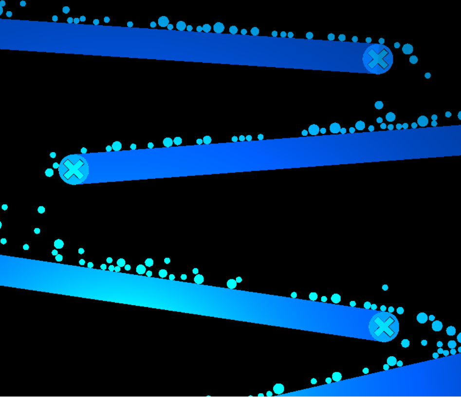

# Circle-Physics-Sandbox
2D Circle physics sandbox featuring circle-circle and circle-line collision detection with adjustable gravity.  Resolves both static and dynamic collisions (i.e. non-momentum and momentum conserving collisions).  Default loaded scenario is a waterfall-esque scene with lots of smaller circles.  

## Controls
<ul>
  <li>Select and move circles with <strong>left-click</strong></li>
  <li>Select and launch circles with <strong>right-click</strong></li>
  <li>Create different sized circles with <strong>1-2-3-4</strong></li>
  <li>Create a new line with <strong>L</strong></li>
  <li>Delete all circles with <strong>C</strong></li>
  <li>Delete all lines with <strong>X</strong></li>
</ul>

<a href="https://brock-eng.github.io/circlesim/circlesim.html">Live Version</a>

Originally created using my <a href="https://github.com/brock-eng/Legit-Game-Engine">2D OpenGL C++ game engine</a> and converted to a javascript & web-assembly package using <a href="https://emscripten.org/">emscripten</a>.

